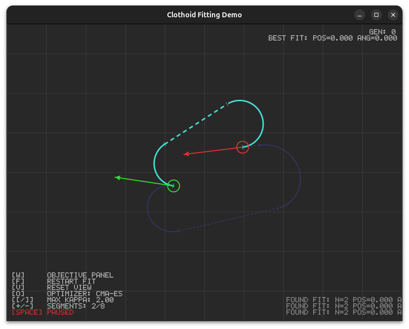

# clothoid

[](https://crates.io/crates/clothoid)
[](https://docs.rs/clothoid)
[](https://joinup.ec.europa.eu/collection/eupl/eupl-text-eupl-12)
[](https://doc.rust-lang.org/edition-guide/)
[](https://www.rust-lang.org)
[](https://github.com/rust-secure-code/safety-dance/)

A Rust library for computing and fitting **Clothoids** (also known as **Euler spirals** or **Cornu spirals**). A clothoid is a curve whose curvature changes linearly with its arc length — the mathematically smooth transition between straight and curved motion, essential for autonomous vehicle path planning, railway design, and CNC toolpath generation.



## Features

- **Path fitting** — fit a smooth clothoid path between any two 2D poses (position + heading)
- **Two optimizers** — Nelder-Mead (fast, default) and CMA-ES (robust on difficult landscapes)
- **Configurable objective** — 12 tunable penalty weights for curvature, symmetry, segment length, G² continuity, etc.
- **High-precision Fresnel integrals** — optional `fresnel` feature crate backend, or built-in approximation (Wilde 2009 / Abramowitz & Stegun)
- **Incremental fitting** — auto-escalates segment count and restarts with randomized initial conditions
- **Interactive demo** — drag start/end poses, tweak weights in real time, watch the optimizer converge

## Quick Start

```rust
use clothoid::Clothoid;

let spiral = Clothoid::new(1.0);
let angle = spiral.direction_angle(0.5); // θ(s) = s² / (2a²)
```

### Path fitting

```rust
use clothoid::fit::{FitState, FitConfig};
use clothoid::optimizer::Pose;

let mut fitter = FitState::new(); // Nelder-Mead
// or: FitState::cma_es() for CMA-ES

let start = Pose::new(-3.0, 0.0, 0.0);
let end   = Pose::new( 3.0, 0.0, 0.0);
let config = FitConfig::default();

let (exploration, best) = fitter.step(&start, &end, &config);
```

## Interactive Demo

The included demo opens a window where you can drag start/end poses and watch the optimizer fit a clothoid path in real time.

```bash
cargo run --release --example interactive_demo
```

### UI Elements

| Visual | Meaning |
|---|---|
| **Green gizmo** | Start pose (circle = position, arrow = heading) |
| **Red gizmo** | End pose (same convention) |
| **Blue dashed line** | Current exploration (optimizer's latest attempt) |
| **Teal solid line** | Best fit found so far (meets tolerance thresholds) |
| **Tick marks** | Segment boundaries on the best-fit path |
| **Background grid** | World coordinate grid (1 unit spacing) |

### Controls

#### Global

| Key | Action |
|---|---|
| **Space** | Pause / resume the optimizer |
| **F** | Restart the fit (reset optimizer state) |
| **V** | Reset camera view |
| **O** | Toggle optimizer: Nelder-Mead ↔ CMA-ES |
| **Esc / Q** | Quit |

#### Mouse

| Action | Effect |
|---|---|
| **Drag start/end circle** | Move the pose position |
| **Drag start/end arrow tip** | Rotate the pose heading |
| **Middle-mouse drag** | Pan the camera |
| **Scroll wheel** | Zoom in/out (centered on cursor) |

#### Tuning Knobs

| Key | Parameter | Range | Default | What it does |
|---|---|---|---|---|
| **+/-** | Max segments | 1–8 | 2 | Maximum clothoid arcs before the fitter restarts. More segments = more flexibility to hit complex poses, but slower convergence. |
| **[/]** | Max κ (curvature) | 0.05–20.0 | 2.0 | Upper bound on absolute curvature any segment may have. Lower values force gentler curves; higher values allow tighter turns. |
| **W** | Objective panel | toggle | hidden | Shows/hides the full weight matrix overlay. |

#### Objective Weights (press when panel is visible)

Each weight cycles through a ladder: `0.0 → 0.01 → 0.05 → 0.1 → 0.25 → 0.5 → 1.0 → 2.5 → 5.0 → 10.0 → 25.0 → 50.0 → 0.0`. Setting a weight to `0.0` disables that penalty term entirely.

| Key | Weight | Default | What it penalises |
|---|---|---|---|
| **1** | `w_end_pos` | 10.0 | Squared distance from path endpoint to target position. The primary "reach the goal" term. |
| **2** | `w_end_angle` | 5.0 | Squared heading error at the endpoint. Ensures the path arrives facing the correct direction. |
| **3** | `w_max_kappa` | 5.0 | Curvature values exceeding the bound set by `[/]`. Keeps curves within drivable curvature limits. |
| **4** | `w_sign_flips` | 0.5 | Adjacent clothoid segments with opposite curvature signs (S-curves). Discourages unnecessary reversing. |
| **5** | `w_kappa_rate` | 0.1 | Rate of curvature change along a segment (`(ke - ks) / length`). Prefers gradual curvature transitions. |
| **6** | `w_g2` | 1.0 | G² continuity violation — curvature mismatch at segment boundaries. Encourages smooth joins (zero curvature jump). |
| **7** | `w_kappa_start_zero` | 0.0 | Non-zero curvature at the very start of the path. Useful when the path must join a straight segment. |
| **8** | `w_kappa_end_zero` | 0.0 | Non-zero curvature at the very end of the path. Useful when the path must exit into a straight segment. |
| **9** | `w_min_seg_len` | 10.0 | Segments shorter than `min_seg_len` (default 0.0, so inactive by default). Eliminates degenerate micro-segments. |
| **0** | `w_total_length` | 0.001 | Total path length. Acts as a regulariser — slightly prefers shorter paths. |
| **Y** | Symmetry mode | Auto | Cycles: Auto → Off → On. When active, penalises asymmetry in mirror-symmetric tasks (start/end poses reflected across midpoint). |

### HUD Readouts

- **GEN** — Generation counter. Increments each time the fitter resets (pose change, optimizer switch, or manual restart).
- **BEST FIT** — Position error, angle error, and total objective score of the best solution found.
- **Log tail** — Last 3 successful fit messages showing segment count and errors.

## What Changes Imply

### Increasing max segments (+ key)

- **More complex paths** — the optimizer can chain multiple clothoid arcs to satisfy difficult pose constraints
- **Slower convergence** — each segment adds 4 parameters (straight length, start κ, end κ, arc length); the simplex grows linearly with dimension
- **Restart cycle** — after 200 failed attempts at the current segment count, the fitter escalates (1 → 2 → … → max), then wraps back to 1

### Tightening max κ ([ key)

- **Gentler curves** — the optimizer is forced to find paths with lower curvature, which may require longer arcs or more segments
- **May prevent convergence** — if the target poses are too close with incompatible headings, no valid low-curvature path exists
- **Visually** — paths become smoother and more spread out

### Raising objective weights

- **Higher priority** — the optimizer will sacrifice other terms to minimise this one. E.g. raising `w_end_pos` to 50 makes reaching the target position dominant over curvature smoothness
- **Trade-offs** — increasing `w_g2` (G² continuity) may increase total path length; increasing `w_sign_flips` may produce longer single-curvature arcs
- **Disabling (0.0)** — removes the constraint entirely. Setting `w_max_kappa = 0` allows arbitrarily tight turns

### Switching optimizers (O key)

| | Nelder-Mead | CMA-ES |
|---|---|---|
| **Speed** | ~500 evaluations per step | ~λ = 4 + ⌊3 ln(n)⌋ candidates per generation |
| **Robustness** | Good for simple, convex landscapes | Better on difficult, non-convex, high-dimensional problems |
| **Best for** | 1–2 segment fits, quick convergence | 4+ segments, tricky pose configurations |

## API Reference

### Core Types

- **`Clothoid`** — single spiral curve parameterised by scaling factor `a`
- **`Pose`** — 2D pose `(x, y, angle)`
- **`FitState`** — stateful incremental fitter; call `step()` each iteration
- **`FitConfig`** — configuration (max segments, max κ, tolerances, objective)
- **`PlanObjective`** — weighted penalty function; `recommended()` for tuned defaults, `default()` for legacy-compatible behaviour

### Feature Flags

| Feature | Description |
|---|---|
| `fresnel` | Enables high-precision Fresnel integral computation via the external `fresnel` crate. When disabled (default), uses an auxiliary-function approximation. |

## Reading Material

- [The Clothoid](https://pwayblog.com/2016/07/03/the-clothoid/)
- [Calculating coordinates along a clothoid between 2 curves](https://math.stackexchange.com/questions/1785816/calculating-coordinates-along-a-clothoid-betwen-2-curves)
- Doran K. Wilde, "Computing Clothoid Segments for Trajectory Generation", IEEE/RSJ IROS 2009
- Abramowitz & Stegun, "Handbook of Mathematical Functions", NBS AMS 55, 1964
